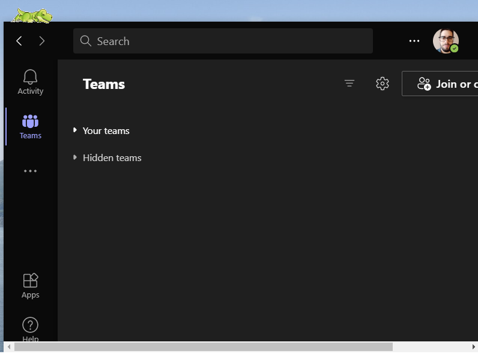
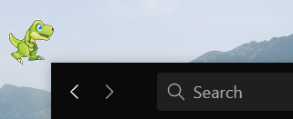

# screenmate-NET at https://github.com/ZoltanDominguez/screenmate-NET

Konfigurálható screenmate alkalmazás a szoftverarchitektúrák tárgy (BME mérnökinformatika MSc) házi feladatának teljesítéseként készült el.

Készítette: Dominguez Zoltán, Biró László

## Screenshots:




## Feladatkiírás
A feladat egy olyan alkalmazás elkészítése, mely egy kis animációt rak a képernyőre (a teljes tartalom fölé), ami megy az egér után, reagál rendszer eseményekre, néha vicces dolgokat művel.
A funkciók:
* Animált mozgás adott tileset alapján, vagy animált gif alapokon.
* Egérkurzor követése, oldalról beugrás stb.
* Egyéb ténykedés (pl. látványos unatkozás), mind külön tileset
* Rendszer eseményekre tud figyelni (processzor 100%, memória >90%, sokáig nincsen felhasználói aktivitás… bővíthető lista. Ilyenkor változhat, hogy mit csinál.)
* Minél szabadabban konfigurálható
* Ablakok tetejére tud állni

A platform: .NET, C# környezet

# A rendszer által biztosítandó tipikus funkciók
A projekt során célunk egy olyan alkalmazás készítése volt, amely egy animált figurát tesz a képernyőre, lehetőleg a futó alkalmazásablakok fölé. Annak érdekében, hogy a felhasználó elől ne takarjon el lényeges információkat, a figura relatíve kis méretű. Az alkalmazás elindítható 2 féle módon:
1. A beállított paraméterekkel, ekkor a figura jelenik meg a képernyőn, és az alkalmazás bezárásáig ott marad, a különböző, lentebb bővebben kifejtett tevékenységeit végzi.
2. A konfigurációs ablakkal, ahol lehetőség van a figura funkcióit aktiválni vagy deaktiválni, illetve minden paraméterezhető változót itt lehet majd beállítani.

Ha a felhasználó nem módosít az alapértelmezett beállításokon, akkor a program indítása után egy animált dinoszaurusz figura jelenik meg a képernyőn. A figura ötféle mozgást végezhet:
* Idle: egyhelyben áll (de itt is végezhet mozgást, pl. szuszog)
* CursorChasing: fut az egérmutató irányába, ha utolérte, akkor örül (alapértelmezettként ugrál), ha egy darabig nem éri el, akkor egy idő után pihen (alapértelmezettként elfekszik)
* Bored: unatkozik (alapértelmezettként ugrál, hogy felhívja magára a figyelmet)
* SittingOnTopOfWindow: séta az egyik ablak tetejéig, majd elfekvés azon
* WarmCPU: „izzad”, jelzi, hogy meleg van (alapértelmezettként ugrál, miközben mellette lángok jelennek meg)

A figura és a mozgások lecserélhetőek, ha a felhasználó a program által specifikált formátumú és darabszámú animációkat tartalmazó képfájlokat elérhetővé teszi a program számára. Ennek definiálására a konfigurációs ablak ad lehetőséget.
A figura a következőképpen cselekszik az alkalmazás elindítása után: megkeresi a Microsoft Teams alkalmazás ablakot, és annak a tetejére, vagy ha az nincs megnyitva, akkor a képernyő felső részére megy a SittingOnTopOfWindow mozgást végezve. Minden tízzel osztható percben viszont kurzorkövető üzemmódba kapcsol, és a CursorChasing mozgást végzi és követi az egérmutatót. Ha eléri nagyon örül és ugrálni kezd.

Az alapeseten kívüli mozgások bekövetkezése:
* ha a kurzorral nem mozdulunk, akkor a konfigurációs fájlban megadható limitnek megfelelő másodperc elteltével a Bored mozgásra vált át, jelenleg ugrálni kezd.
* ha a processzor kihasználtsága a konfigurációs fájlban megadható határérték fölé megy, akkor a WarmCPU mozgást végzi, egy láng mellett ugrál.

A rendszer által biztosítandó funkció továbbá a konfiguráció megadhatósága: Egy konfigurációs ablakban megadott értékek változtatásával, illetve a „Mentés” gombra kattintással a rendszer által a program indításakor minden esetben beolvasott JSON formátumú fájl módosításra kerül. Ezt a fájlt csak ebben a konfigurációs ablakban tudjuk módosítani, a program magától egyéb módosítást nem végez rajta. Lehetőség van kézzel is módosítani a fájlt, a fájlformátum betartásával.

A konfigurációs ablakban a következőket lehet megadni:
* Az összes mozgáshoz egy mappa rendelése, amelyben az animációhoz szükséges képek találhatóak
* A processzor és a memória kihasználtsági hatérértékének megadása
* A Bored mozgásra váltás előtti várakozási idő megadása
* Bored mozgás engedélyezése/letiltása
* Kurzorkövetés (CursorChasing mozgás) engedélyezése/letiltása

### A program környezet
A definiált alkalmazást .NET Core alapokon készítettük el, a fejlesztés 100%-ban C# nyelven történt. Az alkalmazás nagy mennyiségű adatot nem tárol, csak a program beállításokat, illetve a konfigurációs fájlt, emiatt adatbázis létrehozására és elérésére nem volt szükség.
A konfigurációs fájl JSON formátumú, az alkalmazás indulásakor minden esetben ebből a fájlból tölti be a konfigurációs értékeket (amennyiben létezik). A fájl szerkeszthető, néhány kulcs-érték pár található benne a konfigurációhoz kapcsolódóan.
A program ezen változatát specifikusan Windows platformra terveztük. A program funkcionalitásának lehető legnagyobb mértékű kihasználásához a Microsoft Teams alkalmazás megnyitása ajánlott, ezen ablak tetejére tud lefeküdni a figura. Ez az érték jelenleg nem konfigurálható, csak kódból.
Az architektúrát úgy építettük fel, hogy a platformspecifikus működés jól elhatárolható legyen a platformfüggetlen részektől, későbbi verzióban így akár más platformra is megvalósítható az alkalmazás magjának felhasználásával és az architektúra módosítása nélkül.
 
## Megvalósítás
Az alábbi két alkalmazás futtatható:
1.	**ScreenMateConfigurator.exe**
Konfiguráció megadása az alkalmazáshoz. Ez egyszerű WinForms felületen lehet megadni az értékeket, mentés gombra egy JSON fájlba mentődik az érték. A LocalSettings osztály felelős a szerializálásért és deszerializálásért, ezen keresztül lehet menteni az értékeket
2.	**ScreenMateNET.exe**
A konfigurációnak megfelelően indul el a ScreenMate. Az alap állapota az, hogy a MS Teams alkalmazásra tetejéhez fut és ráfekszik. 
### Architektúra
Az architektúra tervezéskor abban állapodtunk meg, hogy két nagyobb mintát fogunk használni.
•	MVVM a rétegek funkcionalitásának leválasztásához
•	Reactor minta az események és a különböző állapotok eseményvezérelt kezeléséhez
További kisebb mintákat is használtunk, például Wrapper osztály, Singleton minta.
### Konfigurátor
A Konfigurátor alkalmazás egyszerűsége nem követelt meg architektúrát, egy ISettings interfészű osztályra van szüksége a megfelelő formátumú mentéshez.
### ScreenMate
A ScreenMate alkalmazás jóval bonyolultabb, 3 rétegű architektúrával lett megvalósítva. A View réteg tulajdonképpen az induló Form és az OnPaint metódutsa. 
A View csupán az ISCreenMateVMClient interfész használja. Egy bitmapet kap, illetve egy eseményre tud feliratkozni, ami azt jelzi neki, hogy újra kell rajzolnia a bitmapet. A pozíciót is el tudja kérni a VM osztálytól, ami azért szükséges, mert a pozíció nem állandó. Az interfészben szerepel a következő pozíció is, de ez nincs implementálva, későbbi interpoláció miatt van neki hely fenntartva.
ScreenMateVMClient egy ViewModel ként működik.  Az üzleti logika alapján előállítja a megfelelő megjelenítési logikát. Egy Reactor osztályt példányosít, melynek az üzenetére feliratkozik, a Reactor osztály akkor süti el az eseményt, mikor valamelyik állapot megváltozik.
A Reactor példányosítja és regisztrálja a különböző eseményküldő állapotokat. Azok üzeneteire feliratkozik, jelenleg minden üzenetre ugyanúgy reagál, üzenetet küld a VM-nek. Később elképzelhetők olyan üzenetek és eseményküldők, melyhez más kezelés szükséges, illetve elképzelhető, hogy más, akár több helyre kell továbbítani, vagy szűrni kell az eseményeket. Az események kezelése rövid ideig tart, és viszonylag ritkán érkeznek.
Az eseménykezelők egyszerű létrehozása adott az SMEventSenderBase ősosztálynak köszönhetően. Egy példa implementáció egy konkrét eseményküldőre:

```C#
class SMCursorChasing : SMEventSenderBase
	{
		public SMCursorChasing() : base(ScreenMateStateID.CursorChasing) { }
		protected override void EventListenerFunction()
		{
			while (true)
			{
				Thread.Sleep(5000);
				if (DateTime.Now.Minute % 10 == 0)
					IsActive = true;
				else
					IsActive = false;
			}
		}
	} 
```
A konstruktorban saját változókat lehet definiálni, és meg kell hívni az ős konstruktorát az állapotra jellemző ID-val. Egy absztrakt függvény definiálásával valósítható meg a funkcionalitás, ez a függvény egy külön szálban indul el az ősben. Az IsActive property módosítás hatására elsütődik az esemény, amelyre a Reactor figyel és reagál.
A LocalSettings Singletonként biztosítja a beállítások egységes elérését és módosítását.

### Telepítési leírás

A program készítésekor hangsúlyt fektettünk az egyszerű kezelhetőségre és üzembehelyezhetőségre. A szoftvert úgy készítettük el, hogy az első indításkor létrehozzon egy alapértelmezett tartalmú konfigurációs fájlt a megfelelő helyen, illetve annak törlése esetén is helyes működést mutasson. Így a program telepítése mindössze annyiból áll, hogy a közzétett fájlokat egy könyvtárba kicsomagoljuk, majd elindítjuk a ScreenMateNet.exe vagy a ScreenMateConfigurator.exe fájlt.

### A program rendszerkövetelményei

Az alábbi parancsot nem minden esetben kell lefuttatni, könnyen előfordulhat, hogy az alkalmazás e nélkül is hibamentes futást produkál.
Ahogy azt a specifikáció is leírja, a program magától nem értetődő követelményeket nem támaszt a futtató számítógép elé. A program hibamentes futásához azonban lehetséges, hogy szükség lesz parancssorban az alábbi parancs rendszergazdaként történő futtatására:
```
C:\windows\system32> lodctr /r
```
Ha a fenti parancs „Error: Unable to rebuild performance counter setting from system backup store, error code is 2” üzenetet küld, akkor a következő parancs rendszergazdaként történő végrehajtása fogja megoldani a problémát:
```
C:\windows\SysWOW64> lodctr /r
```
### További követelmények:
* operációs rendszer: Windows
* futtatókörnyezet: .NET Core 3.1
